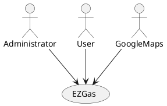
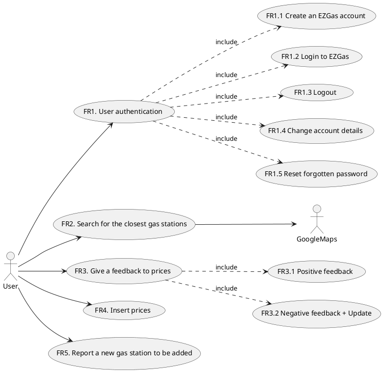

# Requirements Document 

Authors: Cao Peng, Finocchiaro Loredana, Marino Matteo, Mc Mahon Shannon

Date:

Version: 1

# Contents

- [Abstract](#abstract)
- [Stakeholders](#stakeholders)
- [Context Diagram and interfaces](#context-diagram-and-interfaces)
	+ [Context Diagram](#context-diagram)
	+ [Interfaces](#interfaces) 
	
- [Stories and personas](#stories-and-personas)
- [Functional and non functional requirements](#functional-and-non-functional-requirements)
	+ [Functional Requirements](#functional-requirements)
	+ [Non functional requirements](#non-functional-requirements)
- [Use case diagram and use cases](#use-case-diagram-and-use-cases)
	+ [Use case diagram](#use-case-diagram)
	+ [Use cases](#use-cases)
    	+ [Relevant scenarios](#relevant-scenarios)
- [Glossary](#glossary)
- [System design](#system-design)
- [Deployment diagram](#deployment-diagram)

# Abstract

EZGas is a crowdsourcing service that allows users to:
* collect prices of fuels in different gas stations
* locate gas stations in an area, along with the prices they practice.

EZGas is supported by a web application (accessible both via smartphone or PC)

# Stakeholders

| Stakeholder name  | Description | 
| ----------------- |:-----------:|
| Developer | Develops the application and checks periodically for possible raising issues. |
| Administrator | Works closely with the application development teams to tune and troubleshoot the application. Leads and participates in efforts to implement application updates to include upgrades, patches, and new releases with the goal of meeting the end users' needs. He is fully responsible for daily monitoring and maintanance activities (monitors and if neccessary can ban users, stop hackers, fix accounts). | 
| User | Uses the application directly, because he is interesting in finding the closest gas stations (or the most convenient one) and in keeping prices up to date. |
| GoogleMaps | Provides an Application Program Interface (API) to the application, so that gas stations can be easily localized. |

# Context Diagram and interfaces

## Context Diagram

## Interfaces

| Actor | Logical Interface | Physical Interface  |
| ------------- |:-------------:| -----:|
| Administrator | GUI | Screen, keyboard |
| User | GUI | Smartphone, Internet connection |
| GoogleMaps | API | Internet connection |

# Stories and personas
\<A Persona is a realistic impersonation of an actor. Define here a few personas and describe in plain text how a persona interacts with the system>

\<Persona is-an-instance-of actor>

\<stories will be formalized later as use cases>

# Functional and non functional requirements

## Functional Requirements

| ID        |  | Description  |
| ------------- | ------: |:-------------:| 
|  FR1     |  | User authentication |
|   	   | FR1.1 | Create an EZGas account  |
|  	 	   | FR1.2 | Login to EZGas |
|   	   | FR1.3 | Logout |
|   	   | FR1.4 | Change account details |
|   	   | FR1.5 | Reset forgotten password |
| FR2	   |  | Search for the closest gas stations (optionally based on maximum distance and/or price) |
| FR3	   |  | Give a feedback based on the correctness of the price |
|		   | FR3.1 | Positive feedback: the price is correct |
|		   | FR3.2 | Negative feedback: the price is not correct + correct price for the update |
| FR4	   |  | Insert prices (when not yet inserted) |
| FR5	   |  | Report a new gas station to be added |

## Non Functional Requirements

| ID        | Type (efficiency, reliability, ..)           | Description  | Refers to |
| ------------- |:-------------:| :-----:| -----:|
|  NFR1     |  Usability | The user interface of the application is simple and intuitive, no training is necessary | All FR |
|  NFR2     | Performance | The application should react with a maximum delay < 1 sec | All FR |
|  NFR3     | Reliability | The downtime of the application should be not higher than 1 hour per year | All FR |
|  NFR4     | Portability | The application runs on Android (from 7.0 to 10.0 version) and iOS (from 9.3.6 to 13.4 version) | All FR |
|  NFR5     | Privacy | The application must satisfy all the GDPR rules | All FR |
|  NFR6     | Domain | Currency (euro, dollar, ...) and units (liter, gallon, ...) depend on the country the user is in | All FR |
|  NFR7     | Localisation | Decimal numbers use . (dot) as decimal separator | |

# Use case diagram and use cases

## Use case diagram

\<next describe here each use case in the UCD>
### Use case 1, UC1
| Actors Involved        |  |
| ------------- |:-------------:| 
|  Precondition     | \<Boolean expression, must evaluate to true before the UC can start> |  
|  Post condition     | \<Boolean expression, must evaluate to true after UC is finished> |
|  Nominal Scenario     | \<Textual description of actions executed by the UC> |
|  Variants     | \<other executions, ex in case of errors> |

##### Scenario 1.1 

\<describe here scenarios instances of UC1>

\<a scenario is a sequence of steps that corresponds to a particular execution of one use case>

\<a scenario is a more formal description of a story>

\<only relevant scenarios should be described>

| Scenario 1.1 | |
| ------------- |:-------------:| 
|  Precondition     | \<Boolean expression, must evaluate to true before the scenario can start> |
|  Post condition     | \<Boolean expression, must evaluate to true after scenario is finished> |
| Step#        | Description  |
|  1     |  |  
|  2     |  |
|  ...     |  |

##### Scenario 1.2

### Use case 2, UC2
..

### Use case
..

# Glossary

\<use UML class diagram to define important concepts in the domain of the system, and their relationships> 

\<concepts are used consistently all over the document, ex in use cases, requirements etc>

# System Design
\<describe here system design>

\<must be consistent with Context diagram>

# Deployment Diagram 

\<describe here deployment diagram >
