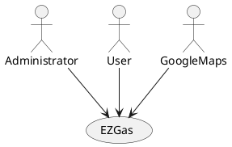
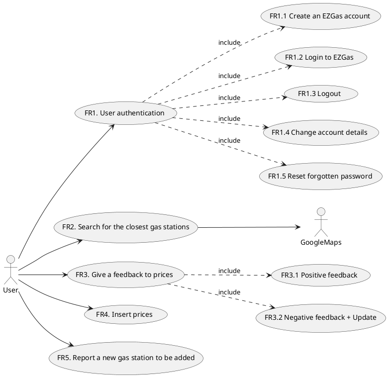

# Requirements Document 

Authors: Cao Peng, Finocchiaro Loredana, Marino Matteo, Mc Mahon Shannon

Date:

Version: 1

# Contents

- [Abstract](#abstract)
- [Stakeholders](#stakeholders)
- [Context Diagram and interfaces](#context-diagram-and-interfaces)
	+ [Context Diagram](#context-diagram)
	+ [Interfaces](#interfaces) 
	
- [Stories and personas](#stories-and-personas)
- [Functional and non functional requirements](#functional-and-non-functional-requirements)
	+ [Functional Requirements](#functional-requirements)
	+ [Non functional requirements](#non-functional-requirements)
- [Use case diagram and use cases](#use-case-diagram-and-use-cases)
	+ [Use case diagram](#use-case-diagram)
	+ [Use cases](#use-cases)
    	+ [Relevant scenarios](#relevant-scenarios)
- [Glossary](#glossary)
- [System design](#system-design)
- [Deployment diagram](#deployment-diagram)

# Abstract

EZGas is a crowdsourcing service that allows users to:
* collect prices of fuels in different gas stations
* locate gas stations in an area, along with the prices they practice.

EZGas is supported by a web application (accessible both via smartphone or PC)

# Stakeholders

| Stakeholder name  | Description | 
| ----------------- |:-----------:|
| Developer | Develops the application and checks periodically for possible raising issues. |
| Administrator | Works closely with the application development teams to tune and troubleshoot the application. Leads and participates in efforts to implement application updates to include upgrades, patches, and new releases with the goal of meeting the end users' needs. He is fully responsible for daily monitoring and maintanance activities (monitors and if neccessary can ban users, stop hackers, fix accounts). | 
| User | Uses the application directly, because he is interesting in finding the closest gas stations (or the most convenient one) and in keeping prices up to date. |
| GoogleMaps | Provides an Application Program Interface (API) to the application, so that gas stations can be easily localized. |

# Context Diagram and interfaces

## Context Diagram

## Interfaces

| Actor | Logical Interface | Physical Interface  |
| ------------- |:-------------:| -----:|
| Administrator | GUI | Screen, keyboard |
| User | GUI | Smartphone, Internet connection |
| GoogleMaps | API | Internet connection |

# Stories and personas

Alice, Susan and Ally are a group of friends that love to travel by car. Since they visit new places, one of the challenges they face during their trips is finding gas stations to refill their car when they are running low on fuel. They've often had to ask the local people for information for the nearest gas stations. They would like to have a simpler way of locating gas stations with respect to their position.

Larry is a truck driver.
Everyday he travels long distances through areas that most of the time he is not familiar with. It would be very useful for him to know where gas stations near him are located when he needs to refill, especially the most convenient one.

Abigail has always believed that knowledge is power.
That’s why when she sees an offer, she thinks everyone should know about it. She works an hour from home and knows first-hand how expensive fuel can be as she relies on her car to get her there. For this reason, when she comes across a gas station with good fuel prices, she would love to be able to share this information with whoever could benefit from it.

Sara is a nature lover. In order to avoid polluting, she has bought an electric car.
However it can be difficult for her to find gas stations that allow her to charge the battery. She recently found one, and noted it down to share this information with those friends of hers which also have an electric car. 
Sara would like to have a simple way of locating the nearest gas stations that recharges electrical cars, and share this information with others.

John is the administrator of EzGas. Aside from working on application updates and fixing possible bugs, he is responsible for the daily monitoring of users. A certain user has been misusing the application, giving only negative feedback to prices and inserting prices that are never reported by other users who have gone to the same stations. In cases like these, it is John's job to warn the user that he will be banned if the incorrect behaviour continues.

# Functional and non functional requirements

## Functional Requirements

| ID        |  | Description  |
| ------------- | ------: |:-------------:| 
|  FR1     |  | User authentication |
|   	   | FR1.1 | Create an EZGas account  |
|  	 	   | FR1.2 | Login to EZGas |
|   	   | FR1.3 | Logout |
|   	   | FR1.4 | Change account details |
|   	   | FR1.5 | Reset forgotten password |
| FR2	   |  | Search for the closest gas stations (optionally based on maximum distance and/or price) |
| FR3	   |  | Give a feedback based on the correctness of the price |
|		   | FR3.1 | Positive feedback: the price is correct |
|		   | FR3.2 | Negative feedback: the price is not correct + correct price for the update |
| FR4	   |  | Insert prices (when not yet inserted) |
| FR5	   |  | Report a new gas station to be added |

## Non Functional Requirements

| ID        | Type (efficiency, reliability, ..)           | Description  | Refers to |
| ------------- |:-------------:| :-----:| -----:|
|  NFR1     |  Usability | The user interface of the application is simple and intuitive, no training is necessary | All FR |
|  NFR2     | Performance | The application should react with a maximum delay < 1 sec | All FR |
|  NFR3     | Reliability | The downtime of the application should be not higher than 1 hour per year | All FR |
|  NFR4     | Portability | The application runs on Android (from 7.0 to 10.0 version) and iOS (from 9.3.6 to 13.4 version) | All FR |
|  NFR5     | Privacy | The application must satisfy all the GDPR rules | All FR |
|  NFR6     | Domain | Currency (euro, dollar, ...) and units (liter, gallon, ...) depend on the country the user is in | All FR |
|  NFR7     | Localisation | Decimal numbers use . (dot) as decimal separator | |

# Use case diagram and use cases

## Use case diagram

### Use case 1, UC1 - FR1.1 Create an EZGas account
| Actors Involved        | User |
| ------------- |:-------------:| 
|  Precondition     | User U has not subscribed an account with EZGas |  
|  Post condition     | User U is enrolled to EZGas |
|  Nominal Scenario     | User U compiles a form providing the required information; subsequently, he will receive an e-mail with a link to be clicked in order to confirm the subscription. |
|  Variants     | If the inserted e-mail address is not in the valid format, issue warning. |

### Use case 2, UC2 - FR1.2 Login to EZGas 
| Actors Involved        | User |
| ------------- |:-------------:| 
|  Precondition     | User U is enrolled to EZGas |  
|  Post condition     | User U is logged in |
|  Nominal Scenario     | User U inserts his e-mail and password: if these are correct, he will be successfully logged in. |
|  Variants     | E-mail or password (or both of them) is not correct, issue warning |

### Use case 3, UC3 - FR1.3 Logout
| Actors Involved        | User |
| ------------- |:-------------:| 
|  Precondition     | User U is logged in with EZGas |  
|  Post condition     | User U is logged out from EZGas |
|  Nominal Scenario     | User U selects the option "Logout" from the application. |
|  Variants     |  |

### Use case 4, UC4 - FR1.4 Change account details
| Actors Involved        | User |
| ------------- |:-------------:| 
|  Precondition     | User U is logged in with EZGas |  
|  Post condition     | Account details of User U are updated|
|  Nominal Scenario     | User U modifies some personal information (name, address, e-mail, ...) and then inserts the password in order to make modifications permanent. |
|  Variants     | If the inserted password is not correct, issue warning. |

### Use case 5, UC5 - FR1.5 Reset forgotten password
| Actors Involved        | User |
| ------------- |:-------------:| 
|  Precondition     | User U is enrolled to EZGas |  
|  Post condition     | Password of User U is updated|
|  Nominal Scenario     | User U inserts his e-mail address; he will receive an e-mail with a temporary password to be used in order to log in.|
|  Variants     |  |

### Use case 6, FR2 Search for the closest gas stations (optionally based on maximum distance and/or price)

| Actors Involved        | User, GoogleMaps |
| ------------- |:-------------:| 
|  Precondition     | User U is logged in with EZGas, GPS position is activated |  
|  Post condition     | EZGas returns a list of gas stations |
|  Nominal Scenario   | User U selects the interested type of fuel and inserts a maximum distance and/or maximum price in order to filter the results based on these constraints; the application, thanks to GoogleMaps API, will provide a list of gas stations (with respective prices) that satisfies the request. |
|  Variant 1     | User U doesn't insert any preference in terms of maximum distance and/or maximum price. The application will apply default parameters. |
|  Variant 2	 | EZGas returns a list of gas stations that is empty, issue warning. |

##### Scenario 6.1

| Scenario ID: SC6.1        | Corresponds to UC6  |
| ------------- |:-------------| 
| Description | User U wants to search for the closest gas stations (filter parameters are set) |
| Precondition | User U has logged in with EZGas, GPS position is activated |
| Postcondition | List of gas stations provided based on the GPS position and filter parameters |
| Step#        |  Step description   |
|  1     | User U selects the type of the fuel he's interested in |  
|  2     | User U inserts a maximum distance in order to filter the results |
|  3     | User U inserts (optionally) a maximum price in order to apply a second filter to the results |
|  4 	 | The search process starts |
|  5	 | EZGas provides a list of gas stations based on the GPS position and ordered by distance and, eventually, by price |

##### Scenario 6.2

| Scenario ID: SC6.2        | Corresponds to UC6  |
| ------------- |:-------------| 
| Description | User U wants to search for the closest gas stations (no filter parameter is set) |
| Precondition | User U has logged in with EZGas, GPS position is activated |
| Postcondition | List of gas stations provided based only on the GPS position |
| Step#        |  Step description   |
|  1     | User U selects the type of the fuel he's interested in |  
|  2     | "Maximum distance" field is left empty (default value will be used) |
|  3     | "Maximum price" field is left empty (default: no upper bound to the price) |
|  4 	 | The search process starts |
|  5	 | EZGas provides a list of gas stations based only on the GPS position, using a default value (e.g. 5 km) as maximum distance of gas stations from the User's position. |

### Use case 7, UC7 - FR3.1  Positive feedback: the price is correct 

| Actors Involved        | User |
| ------------- |:-------------:| 
|  Precondition     | User U is logged in, GPS position is activated |  
|  Post condition     | Number of positive feedbacks for the price P of fuel type F at the gas station has been incremented by 1 |
|  Nominal Scenario     | User U selects price P of the fuel type F of the gas station he is at, selects "give positive feedback", and quantity of positive feedbacks is incremented for (P, F). |
|  Variants     | |

### Use case 8, UC8 - FR3.2 Negative feedback: the price is not correct + correct price for the update

| Actors Involved        | User |
| ------------- |:-------------:| 
|  Precondition     | User U is logged in, GPS position is activated |  
|  Post condition     | Number of negative feedbacks for the price P of fuel type F at the gas station has been incremented by 1, New price P' for F has been added to the system by U |
|  Nominal Scenario     | User U selects price P of the fuel type F of the gas station he is at, selects "give negative feedback", then U inserts correct price of F, and quantity of negative feedbacks is incremented for (P,F). |
|  Variants     | User U inputs invalid price (negative price or invalid format), issue warning. |

##### Scenario 8.1

| Scenario ID: SC8.1        | Corresponds to UC8  |
| ------------- |:-------------| 
| Description | Price P of a fuel type in a certain gas station is incorrect, so the User U gives the price a negative feedback and inserts the correct one|
| Precondition | User U is logged in and has just performed a search (interested type of fuel F already selected) |
| Postcondition | Number of negative feedbacks for the price P of fuel type F at the gas station has been incremented by 1, New price P' for F has been added to the system by U |
| Step#        |  Step description   | 
|  1     | User U gives a negative feedback to the price P of fuel F for a certain gas station |
|  2     | User U inputs the correct price P' for F |
|  3 	 | User U submits feedback |
|		 | (The new (correct) price will be effectively added when the number of Users that have inserted the same price will be higher than a certain bound.) |

### Use case 9, UC9 - FR4 Insert prices (when not yet inserted)

| Actors Involved        | User |
| ------------- |:-------------:| 
|  Precondition     | User U is logged in with EZGas, prices not available yet |  
|  Post condition     | Prices for a selected gas station are inserted |
|  Nominal Scenario     | User U has just performed a search and then he reaches a certain gas station. Once there, he inserts the prices of the day. |
|  Variants     |  |

### Use case 10, UC10 - FR5 Report a new gas station to be added

| Actors Involved        | User |
| ------------- |:-------------:| 
|  Precondition     | User U is logged in with EZGas |  
|  Post condition     | Number of reports for the specific gas station incremented by one |
|  Nominal Scenario     | User U sends a request for reporting a gas station that hasn't been inserted yet in EZGas. The request will remain pending until it reaches a certain quantity N of reports from different users. |
|  Variants     | If the request is the Nth one related to that specific gas station, this will be added among the available ones. |

##### Scenario 10.1

| Scenario ID: SC10.1        | Corresponds to UC10  |
| ------------- |:-------------| 
| Description | User U wants to report a gas station not already inserted (1st report for that gas station) |
| Precondition | User U has logged in with EZGas |
| Postcondition | Number of indications for that specific gas station incremented by one |
| Step#        |  Step description   |
|  1     | User U inserts required information about a certain gas station|
|  2     | User U confirms and sends the request |
|   	 | (The request will remain pending until that gas station receives at least N reports by different users.) |

##### Scenario 10.2

| Scenario ID: SC10.2        | Corresponds to UC10  |
| ------------- |:-------------| 
| Description | User U wants to report a new gas station not already inserted (Nth report for that gas station) |
| Precondition | User U has logged in with EZGas |
| Postcondition | Number of indications for that specific gas station incremented by one. Tot_reports = N, gas station added among the available ones |
| Step#        | Step description  |
|  1     | User U inserts required information about a certain gas station|  
|  2     | User U confirms and sends the request |
|  3     | Since the request is the Nth one related to that specific gas station, this will be added among the available ones. |

# Glossary

\<use UML class diagram to define important concepts in the domain of the system, and their relationships> 

\<concepts are used consistently all over the document, ex in use cases, requirements etc>

# System Design
\<describe here system design>

\<must be consistent with Context diagram>

# Deployment Diagram 

\<describe here deployment diagram >
